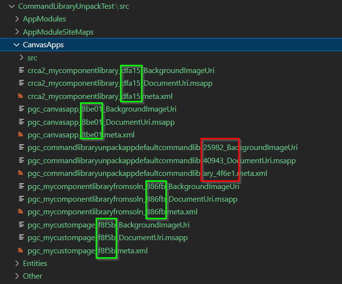
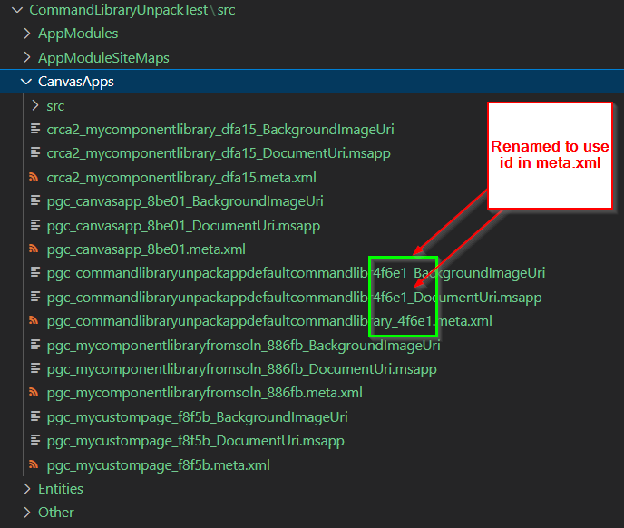

# SolutionFixComponentLibraryFilename

Default component libraries output with random filename, this script standardises the filenames generated.

Note: This issue only occurs when the component library logical name is over a certain length.

## Before

## After

